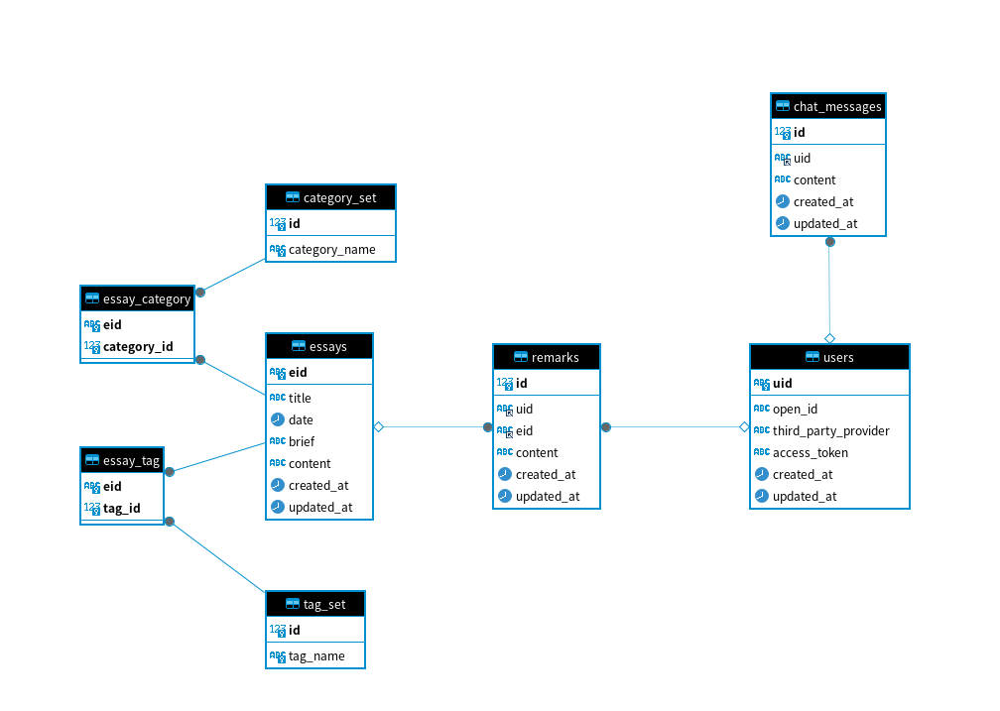

## Data Base


## api

### api Router

**/api**

### /api sub Router

**/essayinfolist**

- params

```json
{}
```

- response

```json
[
    {
        "eid": "6b4357a0-a2fe-483f-9196-c0c9bca9dbd7",
        "title": "A",
        "date": "2024-01-28T10:05:18",
        "categories": [
          "category1",
          "category2",
        ],
        "tags": [
          "tag1",
          "tag2"
        ],
        "brief": "brief1"
    },
    {
        "eid": "4d93cdf6-0993-4477-8be3-04e4d5b3ef2e",
        "title": "B",
        "date": "2023-08-15T21:49:02",
        "categories": [
          "category3"
        ],
        "tags": [
          "tag3"
        ],
        "brief": "brief2"
    }
]
```

**/queryessaycontent**

- params

```json
{
    "eid": "4d93cdf6-0993-4477-8be3-04e4d5b3ef2e"
}
```

- response

```json
HTML String
```